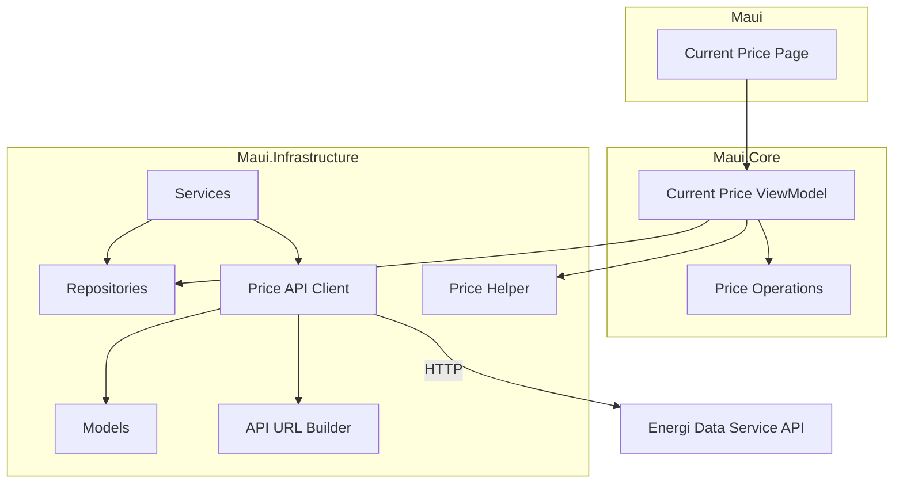
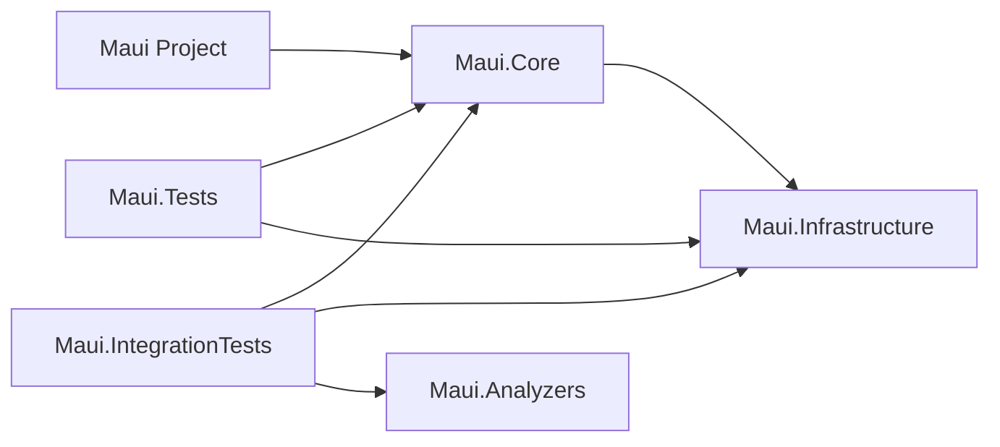

# Architecture

## Overview

This document describes the technical architecture of the Electricity Price Optimizer app, showing how data flows from external APIs through the application to the user interface.

## High-Level Architecture



## Component Responsibilities

### External Layer

**Energi Data Service API**
- Danish energy data service (https://api.energidataservice.dk)
- Provides real-time electricity prices via DayAheadPrices dataset
- Supplies price data for different Danish price areas (DK1, DK2)

### Infrastructure Layer (`Maui.Infrastructure`)

The infrastructure layer provides low-level services. This layer has no MAUI dependencies and can run on Linux, making it suitable for CI/CD testing.

**Repositories** (`Repositories/`)
- `IPriceRepository`: Interface for price data storage
- `InMemoryPriceRepository`: In-memory implementation for fast access
- Raises `PricesUpdated` event when prices change

**Services** (`Services/`)
- `PriceSyncService`: Fetches prices from API and stores in repository
- `BackgroundPriceSyncService`: Hosted service that syncs prices periodically
- Uses `PriceSyncOperations` static class for pure logic

**Price API Client** (`Api/PriceApiClient.cs`)
- Extension method on HttpClient: `GetDayAheadPricesAsync()`
- Handles HTTP communication with the API
- Deserializes JSON responses to strongly-typed models
- Parameters: price area, start date, end date

**API URL Builder** (`Api/PriceApiUrlBuilder.cs`)
- Builds properly formatted API URLs
- Handles timezone conversion to Danish time (Central European Standard Time)
- Formats query parameters (offset, filter, sort)
- Base URL: `https://api.energidataservice.dk/dataset/DayAheadPrices`

**API Models** (`Models/`)
- `PriceRecord`: Price record with UTC timestamp, price area, and prices in DKK
- `DayAheadPricesResponse`: Contains list of API price records
- `DayAheadPriceRecord`: API model for individual price record

**Price Helper** (`PriceHelper.cs`)
- Extension methods for price operations
- `GetCurrentPrice()`: Finds the price record for the current time
- `GetTodayDateRange()`: Calculates date range for today's prices

### Business Logic Layer (`Maui.Core`)

The business logic layer contains ViewModels and feature-specific logic as well as app specific business logic and services. This layer uses CommunityToolkit.Mvvm but has no direct MAUI UI dependencies, allowing it to run on Linux for CI/CD testing.

**Features** are organized using vertical slice architecture, with parallel folder structure to the UI layer.

**Shared/repositories** contains storage class. A repository contains minimal logic. It's mainly a storage location.
**Shared/models** contains records used by features.
**Shared/services** contains app wide services.

### UI Layer (`Maui`)

The UI layer contains XAML pages and platform-specific code. This layer requires Windows runners for CI/CD due to MAUI workload dependencies.

**Features** mirror the `Maui.Core` structure:

**IMPORTANT: ContentView Pattern**

Features are implemented as `ContentView` components, not `ContentPage`:

- **Feature Views**: Each feature is a `ContentView` (e.g., `CurrentPriceView.xaml`, `SyncStatusView.xaml`)
  - Self-contained, reusable UI component
  - Data bindings to its own ViewModel
  - Can be composed into pages or other views

- **Page Composition**: Main pages compose multiple ContentViews together
  - Example: `MainPage.xaml` contains `SyncStatusView` and `CurrentPriceView`
  - Each view receives its ViewModel via `BindingContext`

## Project Structure

```
Maui/
├── Maui/                           # Main MAUI application (Windows-only)
│   ├── Features/                   # Feature UI (vertical slices)
│   │   ├── Counter/               # Counter UI
│   │   │   ├── CounterPage.xaml
│   │   │   └── CounterPage.xaml.cs
│   │   └── CurrentPrice/          # Current price UI
│   │       ├── CurrentPriceView.xaml
│   │       └── CurrentPriceView.xaml.cs
│   ├── Platforms/                  # Platform-specific code
│   ├── Resources/                  # Images, fonts, styles
│   ├── App.xaml                    # Application entry
│   ├── AppShell.xaml              # Shell navigation
│   └── MauiProgram.cs             # DI configuration
├── Maui.Core/                      # Business logic (Linux-compatible)
│   ├── Features/                   # Feature logic (vertical slices)
│   │   ├── Counter/               # Counter logic
│   │   │   └── CounterViewModel.cs
│   │   └── CurrentPrice/          # Current price logic
│   │       ├── CurrentPriceViewModel.cs
│   │       └── CurrentPriceOperations.cs
│   └── Maui.Core.csproj
├── Maui.Infrastructure/            # Shared infrastructure (Linux-compatible)
│   ├── Api/
│   │   ├── Models/
│   │   │   ├── DayAheadPriceRecord.cs
│   │   │   └── DayAheadPricesResponse.cs
│   │   ├── PriceApiClient.cs
│   │   └── PriceApiUrlBuilder.cs
│   ├── Models/
│   │   └── PriceRecord.cs
│   ├── Repositories/
│   │   ├── IPriceRepository.cs
│   │   └── InMemoryPriceRepository.cs
│   ├── Services/
│   │   ├── PriceSyncService.cs
│   │   └── BackgroundPriceSyncService.cs
│   ├── PriceHelper.cs
│   ├── DateTimeExtensions.cs
│   └── Maui.Infrastructure.csproj
├── Maui.Analyzers/                 # Roslyn analyzer for pure functions
│   ├── PureFunctionAnalyzer.cs
│   └── Maui.Analyzers.csproj
├── Maui.Tests/                     # Unit tests (Linux-compatible)
│   ├── Infrastructure/
│   │   ├── Api/
│   │   │   ├── PriceApiClientTests.cs
│   │   │   ├── DayAheadPriceModelTests.cs
│   │   │   └── PriceApiUrlBuilderTests.cs
│   │   └── PriceHelperTests.cs
│   └── Maui.Tests.csproj
└── Maui.IntegrationTests/          # Integration tests (Linux-compatible)
    ├── Analyzers/
    │   └── PureFunctionAnalyzerTests.cs
    ├── Infrastructure/Api/
    │   └── PriceApiIntegrationTests.cs
    └── Maui.IntegrationTests.csproj
```

### Project Dependencies



### Dependency Flow

The three-layer architecture:

1. **Maui.Infrastructure** (bottom layer)
   - Low-level services
   - No dependencies on other projects
   - Linux-compatible (no MAUI dependencies)

2. **Maui.Core** (middle layer)
   - Business logic and ViewModels
   - Data repositories, models and app wide services
   - Depends only on Maui.Infrastructure
   - Uses CommunityToolkit.Mvvm but no MAUI UI
   - Linux-compatible

3. **Maui** (top layer)
   - UI pages and platform-specific code
   - Depends on both Maui.Core and Maui.Infrastructure
   - Requires MAUI workloads

## Key Design Patterns

### Multi-Project Vertical Slice Architecture

The application maintains vertical slice architecture across multiple projects by duplicating the folder structure.

**Example structure for a feature:**
```
Maui/Features/CurrentPrice/
├── CurrentPriceView.xaml      # UI definition (ContentView)
└── CurrentPriceView.xaml.cs   # Platform-specific wiring

Maui.Core/Features/CurrentPrice/
├── CurrentPriceViewModel.cs   # Business logic
└── CurrentPriceOperations.cs  # Static operations
```

### MVVM Pattern with Event-Driven UI Updates

- **Model**: Domain models in Maui.Infrastructure (PriceRecord, etc.)
- **ViewModel**: Business logic in Maui.Core using CommunityToolkit.Mvvm
  - `[ObservableProperty]` for bindable properties
  - `[RelayCommand]` for commands
  - Constructor injection for dependencies
  - Event-driven: Subscribes to repository events, raises events for UI
- **View**: XAML ContentViews in Maui with data bindings
  - **Prefer ContentView over ContentPage** for features (better composability)
  - Minimal code-behind: Sets BindingContext, wires up events
  - Handles platform-specific code (accessibility, etc.)
  - ContentPages compose multiple ContentViews together

**Event Flow:**
1. Repository raises `PricesUpdated` event
2. ViewModel receives event, updates computed properties
3. ViewModel calls `OnPropertyChanged()` to notify UI
4. XAML bindings automatically update

**View Composition Pattern:**
```xml
<!-- MainPage.xaml (ContentPage) -->
<ContentPage>
    <VerticalStackLayout>
        <syncStatus:SyncStatusView BindingContext="{Binding SyncStatus}" />
        <currentPrice:CurrentPriceView BindingContext="{Binding CurrentPrice}"/>
    </VerticalStackLayout>
</ContentPage>
```

### Dependency Injection
- Configured in `MauiProgram.cs`
- Services registered: HttpClient, Repositories, Services, ViewModels, Pages
- Constructor injection throughout the app
- Lifetime management: Singletons for repositories/services, transient for pages

### Extension Methods
- API Client implemented as extension method on HttpClient
- Clean, fluent API: `httpClient.GetDayAheadPricesAsync(...)`
- Price operations as extension methods: `records.GetCurrentPrice()`

### Static Operations Classes

Services, ViewModels, and other stateful classes should extract their pure functions (logic without dependencies) into a companion static operations class located in the same file.

**Pattern Structure:**
```csharp
// Stateful service class with dependencies
public class MyService
{
    private readonly IDependency _dependency;

    public MyService(IDependency dependency)
    {
        _dependency = dependency;
    }

    public async Task DoWorkAsync()
    {
        var data = await _dependency.GetDataAsync();
        var result = MyServiceOperations.TransformData(data); // Pure function
        await _dependency.SaveAsync(result);
    }
}

// Static operations class with pure functions
internal static class MyServiceOperations
{
    public static Result TransformData(Data input)
    {
        // Pure logic with no dependencies or side effects
        return new Result { /* ... */ };
    }
}
```

**Extension Method Syntax Encouraged:**

The operations class should use extension method syntax to enable fluent, chainable calls:

```csharp
internal static class MyServiceOperations
{
    public static Result TransformData(this Data input)
    {
        return new Result { /* ... */ };
    }
}

// Usage:
var result = data.TransformData(); // Fluent style
```

See `PriceSyncOperations` in `Maui.Infrastructure/Services/PriceSyncService.cs` for a reference implementation.

**Applicable for:**
- Data transformations and mappings
- Calculations and business logic
- Validation rules
- Formatting functions
- Logic without dependencies or side effects

**Not applicable for:**
- Logic that requires dependencies (HttpClient, repositories, etc.)
- Operations with side effects (database writes, API calls)
- State management

## Testing Strategy

### Unit Tests (`Maui.Tests`)
- Test individual components in isolation
- Mock external dependencies
- Fast, run frequently during development
- Linux-compatible (runs in CI on Linux)
- Examples:
  - API URL builder formatting
  - Price model deserialization
  - Price helper logic
  - Repository operations
  - ViewModel logic

### Integration Tests (`Maui.IntegrationTests`)
- **API Integration Tests**: Test real API integration
  - Verify endpoint availability
  - Validate data contracts
  - Marked with `[Trait("Category", "Integration")]`
  - Run explicitly, not in normal test runs
  - Example: Real API calls to Energi Data Service

- **Analyzer Tests**: Test Roslyn analyzer for pure functions
  - Uses `Microsoft.CodeAnalysis.Testing` framework
  - Verifies analyzer detects pure functions correctly
  - Tests for false positives (base class methods, extension methods)
  - Linux-compatible (runs in CI on Linux)
  - Example: `PureFunctionAnalyzerTests.cs`

### CI/CD Testing Strategy

The GitHub Actions workflow (`.github/workflows/pr-validation.yml`) runs tests:

1. **Core Unit Tests** (Linux)
   - Runs `Maui.Tests` on ubuntu-latest
   - Tests Maui.Core and Maui.Infrastructure projects
   - No MAUI dependencies

2. **Analyzer Build** (Linux)
   - Builds `Maui.Analyzers` project
   - Verifies analyzer compiles correctly

3. **Analyzer Validation** (Linux)
   - Builds `Maui.Core` with analyzer enabled
   - Detects pure functions that should be extracted
   - Warns (doesn't fail) if analyzer finds issues

## Future Architecture Considerations

The current implementation includes background sync and in-memory storage. Future enhancements may include:

### Database Layer
- SQLite for persistent local price storage
- Offline capability with last known prices
- Faster app startup (no initial API call needed)
- Historical price data retention

### Enhanced Background Sync
- Periodic price updates (currently manual)
- Smart sync timing (check for new prices at 13:00 CET when published)
- Retry logic for failed API calls
- Notifications for significant price changes

### Settings Feature
- Region selection (DK1/DK2, currently hardcoded to DK1)
- Price thresholds and alerts
- Sync frequency configuration
- User preferences

### Additional Features
- Price forecasts (24-48 hours ahead)
- Price graphs and charts (hourly, daily, weekly)
- Optimal usage time recommendations based on price patterns
- Historical price data analysis
- Export price data to CSV/JSON

### Multi-Platform Enhancements
- Platform-specific optimizations
- Native notifications per platform
- Widget support (iOS, Android)
- Desktop-specific features (system tray, always-on-top)

## Technology Stack

- **.NET 9.0**: Core framework
- **.NET MAUI**: Cross-platform UI framework
- **CommunityToolkit.Mvvm**: MVVM helpers and source generators
- **xUnit**: Testing framework
- **System.Text.Json**: JSON serialization
- **HttpClient**: HTTP communication

## Design Principles

1. **Simplicity First**: Start with the simplest implementation that works
2. **Vertical Slices**: Features are independent and self-contained
3. **Dependency Injection**: Loose coupling, easy testing
4. **Separation of Concerns**: Infrastructure, features, and shared code are clearly separated
5. **Testability**: Unit tests and integration tests for different scenarios
6. **Progressive Enhancement**: Architecture allows for future additions without major refactoring
