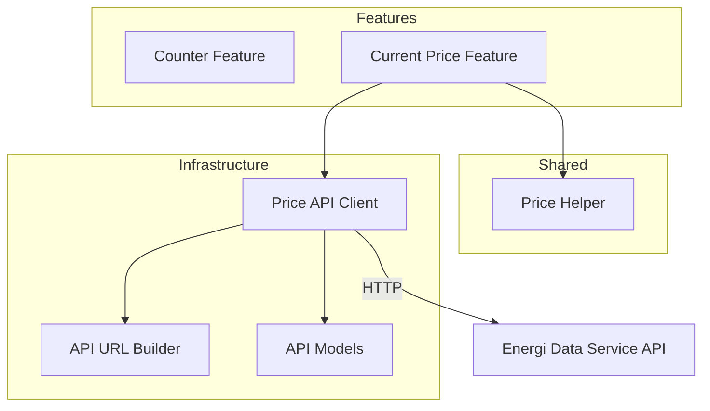
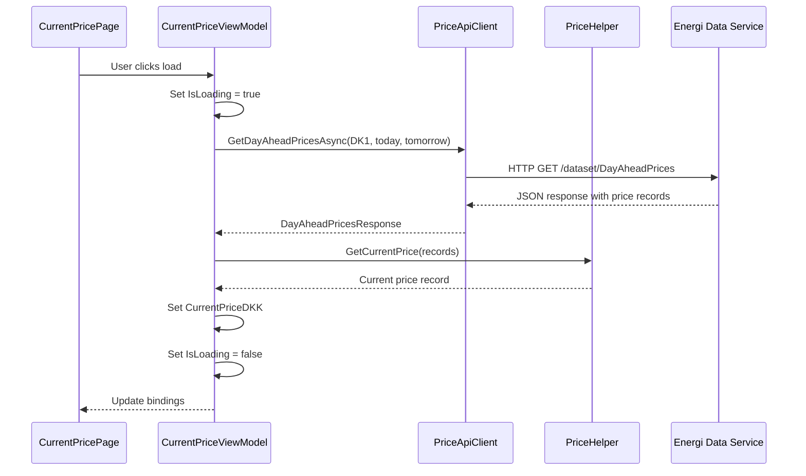

# Architecture

## Overview

This document describes the technical architecture of the Electricity Price Optimizer app, showing how data flows from external APIs through the application to the user interface.

## High-Level Architecture



## Component Responsibilities

### External Layer

**Energi Data Service API**
- Danish energy data service (https://api.energidataservice.dk)
- Provides real-time electricity prices via DayAheadPrices dataset
- Supplies price data for different Danish price areas (DK1, DK2)

### Infrastructure Layer (`Maui.Infrastructure`)

**Price API Client** (`PriceApiClient.cs`)
- Extension method on HttpClient: `GetDayAheadPricesAsync()`
- Handles HTTP communication with the API
- Deserializes JSON responses to strongly-typed models
- Parameters: price area, start date, end date

**API URL Builder** (`PriceApiUrlBuilder.cs`)
- Builds properly formatted API URLs
- Handles timezone conversion to Danish time (Central European Standard Time)
- Formats query parameters (offset, filter, sort)
- Base URL: `https://api.energidataservice.dk/dataset/DayAheadPrices`

**API Models** (`Models/`)
- `DayAheadPricesResponse`: Contains list of price records
- `DayAheadPriceRecord`: Individual price record with UTC/DK timestamps, price area, and prices in EUR/DKK

### Shared Layer (`Maui.Shared`)

**Price Helper** (`PriceHelper.cs`)
- Static helper methods for price operations
- `GetCurrentPrice()`: Finds the price record for the current time
- No state, just utility functions

### Features (Vertical Slices)

Each feature is self-contained in its own folder under `Features/`.

**Counter Feature** (Example/Template)
- **Page**: Simple counter UI
- **ViewModel**: Demonstrates MVVM pattern with CommunityToolkit.Mvvm
- Purpose: Template for creating new features

**Current Price Feature**
- **Page** (`CurrentPricePage.xaml`): Displays current electricity price
- **ViewModel** (`CurrentPriceViewModel.cs`):
  - Injects HttpClient via constructor
  - `LoadCurrentPriceAsync()` command to fetch current price
  - Queries API for today's prices
  - Uses PriceHelper to find current price record
  - Properties: CurrentPriceDKK (nullable decimal), IsLoading (bool), ErrorMessage (string)
  - Handles loading states and errors
- Currently queries API directly (no database, no background sync yet)

## Current Data Flow

### Loading Current Price



## Project Structure

```
Maui/
├── Maui/                           # Main MAUI application
│   ├── Features/                   # Feature folders (vertical slices)
│   │   ├── Counter/               # Example feature
│   │   │   ├── CounterPage.xaml
│   │   │   ├── CounterPage.xaml.cs
│   │   │   └── CounterViewModel.cs
│   │   └── CurrentPrice/          # Current price feature
│   │       ├── CurrentPricePage.xaml
│   │       ├── CurrentPricePage.xaml.cs
│   │       └── CurrentPriceViewModel.cs
│   ├── Platforms/                  # Platform-specific code
│   ├── Resources/                  # Images, fonts, styles
│   ├── App.xaml                    # Application entry
│   ├── AppShell.xaml              # Shell navigation
│   └── MauiProgram.cs             # DI configuration
├── Maui.Infrastructure/            # Shared infrastructure
│   ├── Api/
│   │   ├── Models/
│   │   │   ├── DayAheadPriceRecord.cs
│   │   │   └── DayAheadPricesResponse.cs
│   │   ├── PriceApiClient.cs
│   │   └── PriceApiUrlBuilder.cs
│   └── Maui.Infrastructure.csproj
├── Maui.Shared/                    # Shared utilities
│   ├── PriceHelper.cs
│   └── Maui.Shared.csproj
├── Maui.Tests/                     # Unit tests
│   ├── Infrastructure/
│   │   └── Api/
│   │       ├── PriceApiClientTests.cs
│   │       ├── DayAheadPriceModelTests.cs
│   │       └── PriceApiUrlBuilderTests.cs
│   └── Shared/
│       └── PriceHelperTests.cs
└── Maui.IntegrationTests/          # Integration tests
    ├── Infrastructure/
    │   ├── IntegrationTestBase.cs
    │   ├── TestFixtureBase.cs
    │   └── TestCollectionDefinitions.cs
    └── Infrastructure/Api/
        └── PriceApiIntegrationTests.cs
```

## Key Design Patterns

### Vertical Slice Architecture
- Each feature is self-contained in its own folder
- Feature folders contain: Page (XAML + code-behind) + ViewModel
- Reduces coupling between features
- Easy to add, modify, or remove features independently

### MVVM Pattern
- **Model**: API models in Maui.Infrastructure
- **View**: XAML pages with data bindings
- **ViewModel**: Presentation logic using CommunityToolkit.Mvvm
  - `[ObservableProperty]` for bindable properties
  - `[RelayCommand]` for commands
  - Constructor injection for dependencies

### Dependency Injection
- Configured in `MauiProgram.cs`
- Services registered: HttpClient, ViewModels, Pages
- Constructor injection throughout the app

### Extension Methods
- API Client implemented as extension method on HttpClient
- Clean, fluent API: `httpClient.GetDayAheadPricesAsync(...)`

### Static Operations Classes

Services, ViewModels, and other stateful classes should extract their pure functions (logic without dependencies) into a companion static operations class located in the same file.

**Pattern Structure:**
```csharp
// Stateful service class with dependencies
public class MyService
{
    private readonly IDependency _dependency;

    public MyService(IDependency dependency)
    {
        _dependency = dependency;
    }

    public async Task DoWorkAsync()
    {
        var data = await _dependency.GetDataAsync();
        var result = MyServiceOperations.TransformData(data); // Pure function
        await _dependency.SaveAsync(result);
    }
}

// Static operations class with pure functions
internal static class MyServiceOperations
{
    public static Result TransformData(Data input)
    {
        // Pure logic with no dependencies or side effects
        return new Result { /* ... */ };
    }
}
```

**Extension Method Syntax Encouraged:**

The operations class should use extension method syntax to enable fluent, chainable calls:

```csharp
internal static class MyServiceOperations
{
    public static Result TransformData(this Data input)
    {
        return new Result { /* ... */ };
    }
}

// Usage:
var result = data.TransformData(); // Fluent style
```

See `PriceSyncOperations` in `Maui.Shared.Services/PriceSyncService.cs:56-82` for a reference implementation.

**Benefits:**
- **Testability**: Pure functions are easier to test without mocking dependencies
- **Clarity**: Separates orchestration logic (service) from business logic (operations)
- **Reusability**: Pure functions can be reused across different services
- **Maintainability**: Logic is isolated and can be understood independently
- **Fluent API**: Extension methods enable natural, readable code

**When to Use:**
- Data transformations and mappings
- Calculations and business logic
- Validation rules
- Formatting functions
- Any logic that doesn't require dependencies or side effects

**When NOT to Use:**
- Logic that requires dependencies (HttpClient, repositories, etc.)
- Operations with side effects (database writes, API calls)
- State management

## Testing Strategy

### Unit Tests (`Maui.Tests`)
- Test individual components in isolation
- Mock external dependencies
- Fast, run frequently during development
- Examples:
  - API URL builder formatting
  - Price model deserialization
  - Price helper logic

### Integration Tests (`Maui.IntegrationTests`)
- Test real API integration
- Verify endpoint availability
- Validate data contracts
- Marked with `[Trait("Category", "Integration")]`
- Run explicitly, not in normal test runs
- Examples:
  - Real API calls to Energi Data Service
  - End-to-end data flow validation

## Future Architecture Considerations

The current implementation is intentionally simple. Future enhancements may include:

### Database Layer
- SQLite for local price storage
- Offline capability
- Faster load times

### Background Sync
- Periodic price updates
- Background service/worker
- Notifications for price changes

### Settings Feature
- Region selection (DK1/DK2)
- Price thresholds
- User preferences

### Additional Features
- Price forecasts (24-48 hours ahead)
- Price graphs and charts
- Optimal usage time recommendations
- Historical price data

### Event-Based Updates
- Observable data patterns
- Real-time UI updates
- Loose coupling between components

## Technology Stack

- **.NET 9.0**: Core framework
- **.NET MAUI**: Cross-platform UI framework
- **CommunityToolkit.Mvvm**: MVVM helpers and source generators
- **xUnit**: Testing framework
- **System.Text.Json**: JSON serialization
- **HttpClient**: HTTP communication

## Design Principles

1. **Simplicity First**: Start with the simplest implementation that works
2. **Vertical Slices**: Features are independent and self-contained
3. **Dependency Injection**: Loose coupling, easy testing
4. **Separation of Concerns**: Infrastructure, features, and shared code are clearly separated
5. **Testability**: Unit tests and integration tests for different scenarios
6. **Progressive Enhancement**: Architecture allows for future additions without major refactoring
