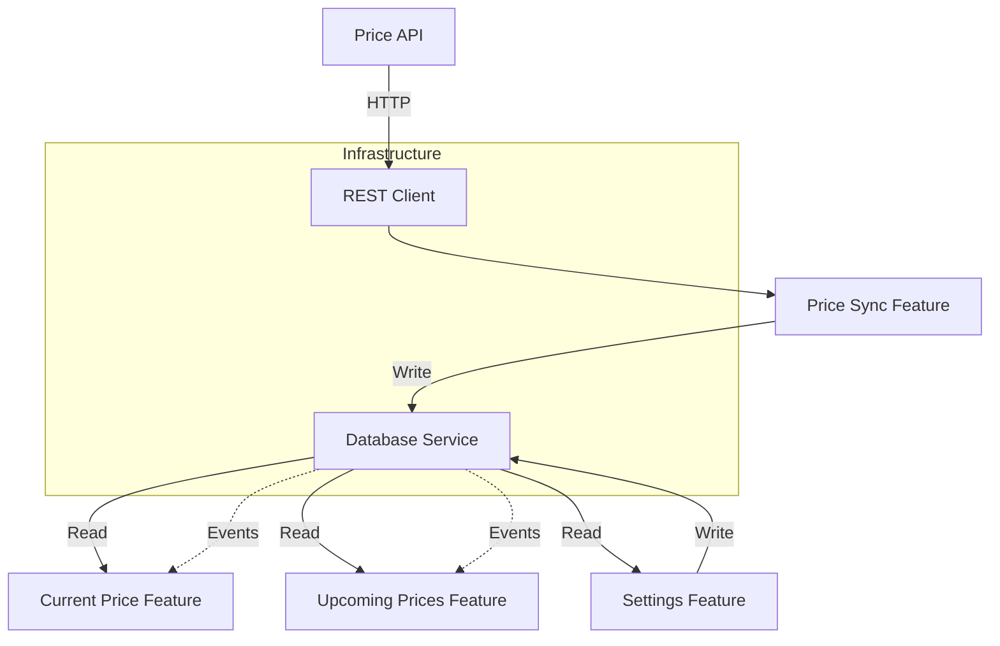
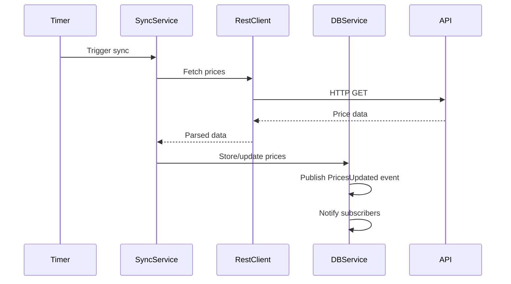
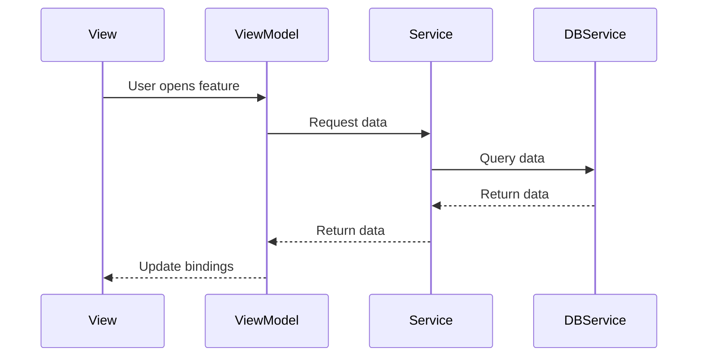
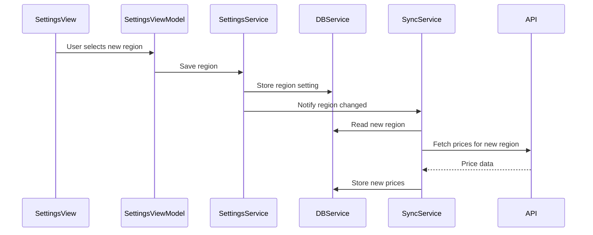

# Architecture

## Overview

This document describes the technical architecture of the Electricity Price Optimizer app, showing how data flows from external APIs through the application to the user interface.

## High-Level Architecture

## Component Responsibilities

### External Layer

**Electricity Price API**
- Provides real-time electricity prices
- Supplies price forecasts for upcoming hours

### Shared Infrastructure

**REST Client**
- Thin wrapper around HTTP communication
- Only used by Price Sync feature
- No business logic

**SQLite Database**
- Raw database file
- Single source of truth for all price data

**Database Service**
- Thin wrapper around SQLite connection
- Manages connection lifecycle
- Publishes events when data changes (e.g., PricesUpdated)
- Features subscribe to events to refresh UI
- Single instance shared across app

**Query Helpers**
- Static factory methods for building common queries
- No state, just helper functions
- Used by feature services to avoid query duplication

### Features (Vertical Slices)

**Price Sync Feature**
- **Service**:
  - Reads region setting from Database
  - Fetches data from API via REST Client for selected region
  - Stores price data in Database
  - Runs on background timer
  - Listens for settings changes and triggers immediate sync
  - Handles sync errors and retries
  - Only feature that talks to the API

**Current Price Feature**
- **Page**: Displays current price with visual indicators
- **ViewModel**: Formats price for display, determines status (cheap/normal/expensive)
- **Service**:
  - Queries current price from Database only
  - No API access
  - Read-only database operations

**Upcoming Prices Feature**
- **Page**: Renders price graph for next 24-48 hours
- **ViewModel**: Prepares chart data, calculates optimal windows
- **Service**:
  - Queries forecast data from Database only
  - No API access
  - Read-only database operations

**Settings Feature**
- **Page**: UI for selecting region and other preferences
- **ViewModel**: Manages settings state
- **Service**:
  - Stores user preferences (region, thresholds, etc.) in Database
  - Notifies Price Sync Service when region changes
  - Read/write database operations for settings

## Data Flow

### Background Sync (Periodic)

### Feature Usage (On Demand)

### Region Change Flow

## Key Design Patterns

### Vertical Slice Architecture
- Each feature is self-contained and owns its complete stack
- Feature folders contain: Page + ViewModel + Service + Models
- Features use Query Helpers for common operations or write custom queries for performance
- Reduces coupling between features
- Only infrastructure (REST Client, Database Service, Query Helpers) is shared

### Write/Read Separation
- **Write**: Price Sync feature writes to database (from API)
- **Read**: Display features only read from database
- Clear separation of concerns
- Display features work offline
- Sync can run independently in background

### Settings as Data
- Region selection and preferences stored in Database
- Settings Feature writes user preferences to Database
- Price Sync Service reads settings from Database (not directly from Settings Feature)
- Settings Feature notifies Price Sync Service when critical settings change
- Database is single source of truth for both prices and settings

### Event-Based Updates
- Database Service publishes events when data changes (e.g., PricesUpdated, SettingsChanged)
- Features subscribe to events via their ViewModels
- On event, ViewModel re-queries data and updates UI bindings
- Keeps UI fresh without polling
- Loose coupling - features don't know who changed the data
